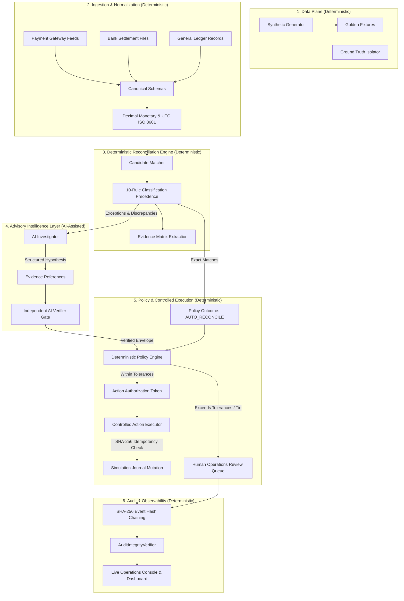

# METFI System Architecture Specification
**Production Modular Monolith with Strict Layer Boundaries**

- **Project:** METFI (Autonomous Finance Controller)  
- **Track:** Razorpay AI Buildathon, Track 04 — AI Finance Controller  
- **Architecture Standard:** Separation of Deterministic Truth & Advisory Intelligence  

---

## 1. Architectural Invariant

> **Deterministic Financial Truth > Policy Engine > AI Recommendation > Action Executor.**

In METFI, deterministic code owns mathematical calculation, candidate matching, exception categorization, policy gating, and ledger state transitions. AI reasoning models provide advisory anomaly investigations and causal explanations—subject to independent automated challenge and policy authorization.

---

## 2. Delineation of Layer Responsibilities

| Layer | Component | Execution Nature | Authority Level | Can Mutate State? |
|---|---|---|---|---|
| **Layer 1** | Data Plane & Ingestion | Deterministic | Input Validator | No |
| **Layer 2** | Canonical Normalization | Deterministic | Mathematical Standardizer | No |
| **Layer 3** | Reconciliation Matcher | Deterministic | Authoritative Truth | No |
| **Layer 4** | AI Investigator | **AI-Assisted (Advisory)** | Structured Hypothesis | **NO** |
| **Layer 5** | AI Verifier Gate | **AI-Assisted / Rule Hybrid** | Factual Challenge Gate | **NO** |
| **Layer 6** | Policy Engine | Deterministic | Authorization Authority | No |
| **Layer 7** | Action Executor | Deterministic | Controlled Executor | **YES (Policy Gated)** |
| **Layer 8** | Cryptographic Audit Ledger | Deterministic | Immutable Recorder | Append-Only |
| **Layer 9** | Operations Dashboard & Benchmarks | UI / Evaluator | Presentation & Reporting | No |

---

## 3. Technology Stack

- **Backend**: Python 3.12, FastAPI 0.111, Pydantic v2, SQLAlchemy 2.x (asyncpg), PostgreSQL 16
- **Frontend**: Next.js 14 (App Router), TypeScript, Tailwind CSS, Lucide React
- **Containerization**: Multi-stage Dockerfiles, Docker Compose (3-tier stack)
- **Quality Assurance**: Pytest (311+ tests), Ruff, Mypy, Playwright/httpx
